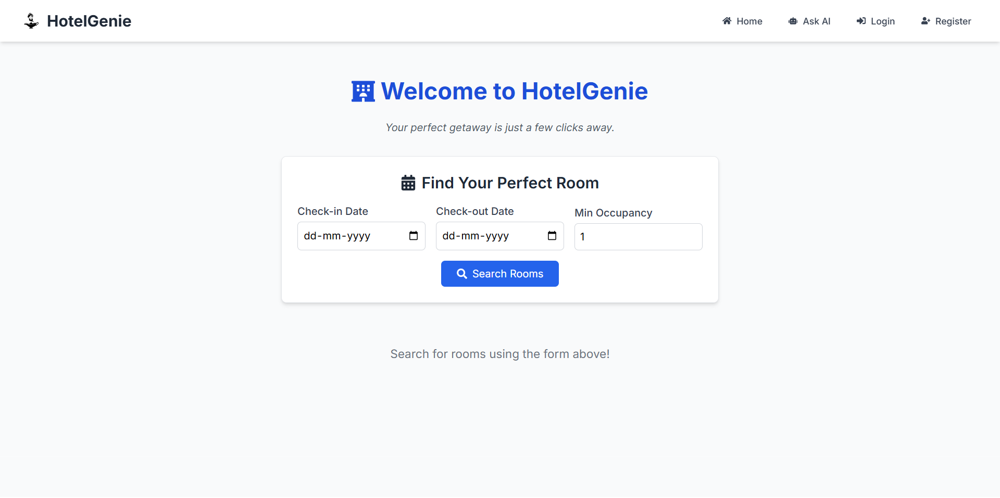
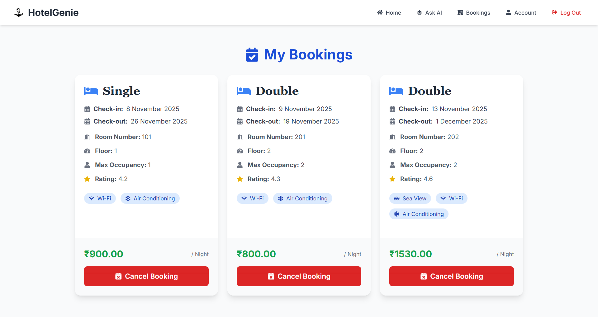
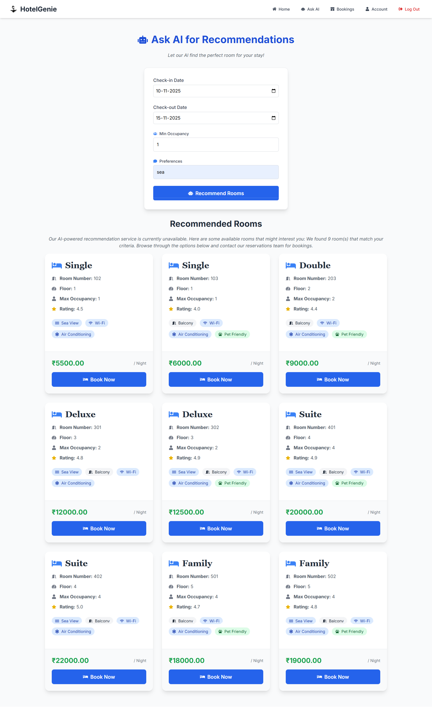

# HotelGenie 🏨✨

**HotelGenie** is a modern, AI-powered hotel booking platform designed to provide a seamless and intelligent user experience. This project demonstrates a full-stack application built with a focus on performance, scalability, and code quality.

[](https://github.com/anandadhikari)


### 📸 Screenshots

#### Dashboard


#### Booking Page


#### AI Recommendations


---

## ✨ Features

-   **🤖 AI-Powered Recommendations:** A unique feature that allows users to get hotel recommendations based on their preferences, powered by a custom AI model.
-   **🔐 Secure User Authentication:** A robust authentication system with JWT, allowing users to register, log in, and manage their accounts.
-   **🏨 Room Booking and Management:** An intuitive interface for users to browse and book rooms.
-   **👑 Admin Dashboard:** A dedicated dashboard for administrators to manage bookings, clients, and rooms.
-   **📱 Fully Responsive Design:** A mobile-first design that looks great on all devices, built with Tailwind CSS.
-   **💨 Fast and Performant:** Built with Vite for a lightning-fast development experience and optimized for production.

---

## 🛠️ Tech Stack

This project is built with a modern and powerful tech stack:

-   **Frontend:**
    -   [React](https://reactjs.org/)
    -   [Vite](https://vitejs.dev/)
    -   [TypeScript](https://www.typescriptlang.org/)
    -   [Tailwind CSS](https://tailwindcss.com/)
    -   [Framer Motion](https://www.framer.com/motion/) for animations
    -   [React Router](https://reactrouter.com/) for client-side routing
-   **Code Quality and Testing:**
    -   [ESLint](https://eslint.org/) for static code analysis
    -   [Prettier](https://prettier.io/) for code formatting
    -   [Vitest](https://vitest.dev/) for unit and component testing
-   **Deployment:**
    -   [Docker](https://www.docker.com/)
    -   [Nginx](https://www.nginx.com/)

---

## 🚀 Getting Started

To get a local copy up and running, follow these simple steps.

### Prerequisites

-   [Node.js](https://nodejs.org/en/) (v20 or later)
-   [npm](https://www.npmjs.com/)
-   [Docker](https://www.docker.com/get-started) (optional, for containerized deployment)

### Installation

1.  **Clone the repository:**
    ```bash
    git clone https://github.com/your-username/hotel-genie-client.git
    cd hotel-genie-client
    ```

2.  **Install NPM packages:**
    ```bash
    npm install
    ```

3.  **Set up your environment variables:**

    Create a `.env` file in the root of the project and add the following variable. This should point to the URL of your backend API.
    ```
    VITE_API_BASE_URL=http://localhost:8080
    ```

### Running the Application

-   **Development Mode:**
    ```bash
    npm run dev
    ```
    The application will be available at `http://localhost:5173`.

-   **Production Build:**
    ```bash
    npm run build
    ```
    This will create a `dist` folder with the production-ready static files.

---

## 🐳 Running with Docker

You can also run the application in a Docker container.

1.  **Build the Docker image:**
    ```bash
    docker build -t hotel-genie-client .
    ```

2.  **Run the Docker container:**
    ```bash
    docker run -p 8080:80 hotel-genie-client
    ```
    The application will be available at `http://localhost:8080`.

**Note:** The Docker container uses Nginx to serve the application. The Nginx configuration includes a proxy for API requests to `/api`. You will need to update the `nginx.conf` file with the URL of your API server.

---

## ⚙️ Scripts

This project includes several scripts to help with development and code quality:

-   `npm run dev`: Starts the development server.
-   `npm run build`: Builds the application for production.
-   `npm run preview`: Previews the production build locally.
-   `npm run format`: Formats all files with Prettier.
-   `npm run lint`: Lints all files with ESLint.
-   `npm run test`: Runs the test suite with Vitest.

---

## 📄 Cursed Developer Contract

Sealed with the Forbidden Open Source Technique.
[The Scroll of Destiny](https://github.com/anandadhikari)
contains what the elders forbade.
